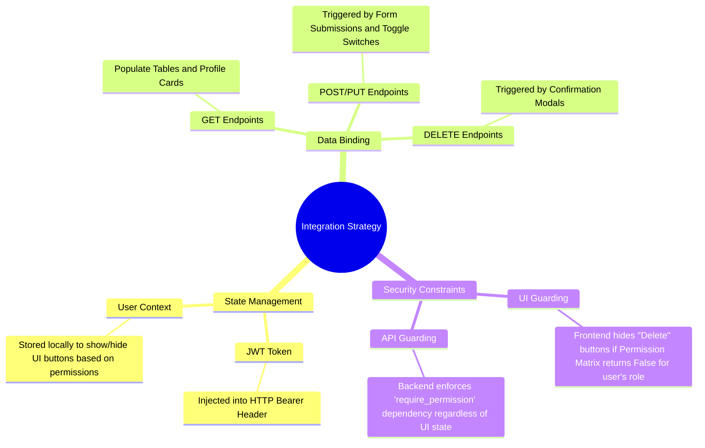

# Backend-Frontend Integration Guide

## 1. Integration Mind Map
This map describes the flow of data between the UI layer and the FastAPI service layer.

## 2. Endpoint Mapping Matrix

| UI Component | Action | API Endpoint | Method |
| :--- | :--- | :--- | :--- |
| **LoginForm** | Submit | `/auth/login` | `POST` |
| **EmployeeTable** | Load | `/employees` | `GET` |
| **SearchBar** | Query | `/employees/department/{d}/skill/{s}` | `GET` |
| **ProfileForm** | Update | `/employees/{id}/update-name` | `PUT` |
| **SkillsCloud** | Add | `/employees/{id}/skills` | `PUT` |
| **SkillsCloud** | Remove | `/employees/{id}/skills/{name}` | `DELETE` |
| **ProjectGrid** | Load | `/projects` | `GET` |
| **AssignmentList** | Add | `/projects/{id}/assign/{emp_id}` | `PUT` |
| **PermissionMatrix** | Toggle | `/permissions/{role}/{resource}` | `PUT` |

## 3. Data Flow Protocol
1.  **Handshake:** User logs in -> Frontend receives JWT and User Role.
2.  **Permission Check:** Frontend fetches `/permissions/{role}` to decide which buttons to render.
3.  **Requests:** All subsequent requests include `Authorization: Bearer <token>`.
4.  **Error Handling:** 
    - `401 Unauthorized`: Redirect to Login.
    - `403 Forbidden`: Show "Access Denied" toast.
    - `422 Unprocessable`: Highlight form validation errors.
